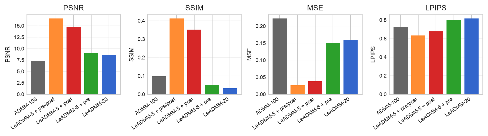
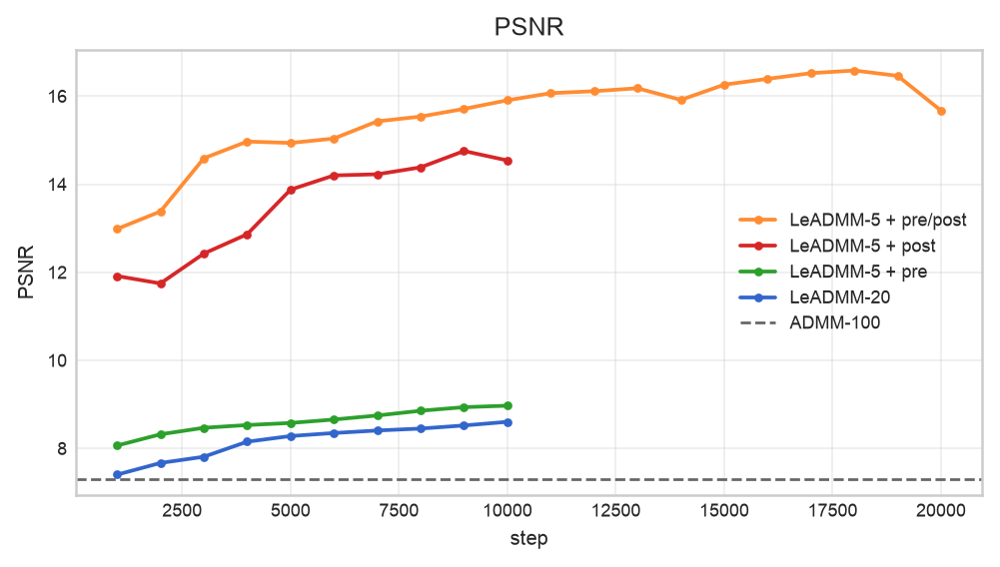
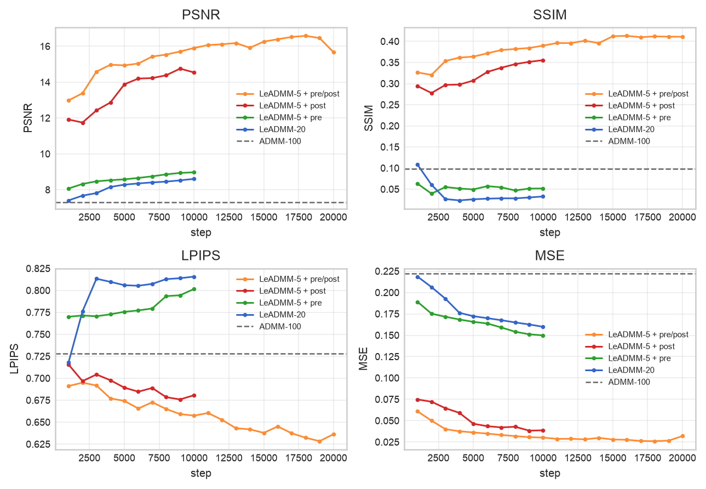
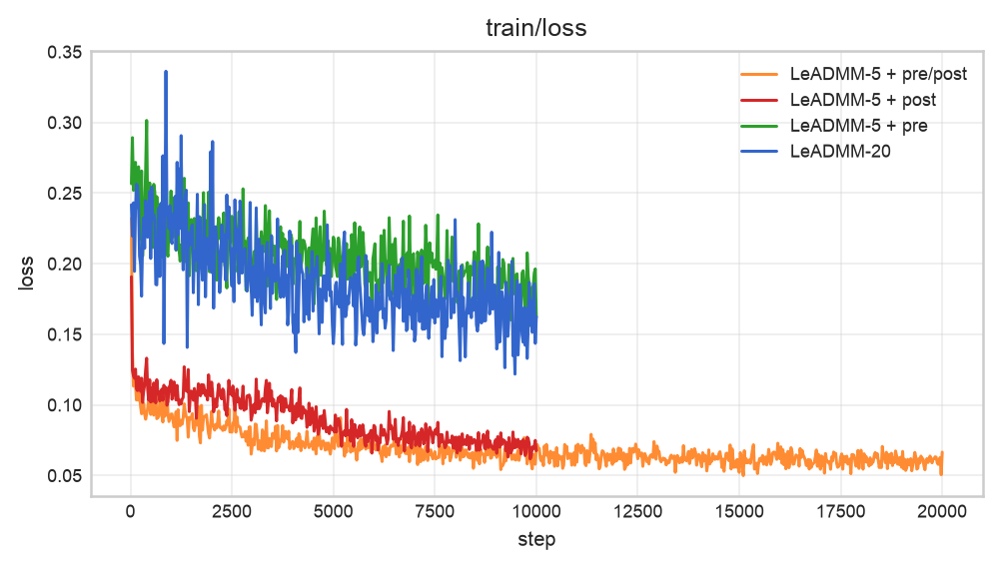

## Comet

Comet ML report: https://www.comet.com/dimadmitrij734/dl-project/reports/6OnKuFrGkBgSivo8nIlfE8IMx

Hugging Face: https://huggingface.co/dimadmitrij734/project_dl/tree/main

## Методы

| Метод | Итоговое качество |
|---|---:|
| ADMM-100 | PSNR = 7.3147 |
| LeADMM-20 | PSNR = 8.6052 |
| LeADMM-5 + pre | PSNR = 8.9719 |
| LeADMM-5 + post | PSNR = 14.7554 |
| LeADMM-5 + pre/post | PSNR = 16.5838 |

## Метрики

Для обучаемых моделей приведены значения, где был максимальный test PSNR.

| Метод | Step | MSE | PSNR | SSIM | LPIPS |
|---|---:|---:|---:|---:|---:|
| ADMM-100 | 0 | 0.2223 | 7.3147 | 0.0983 | 0.7279 |
| LeADMM-20 | 10000 | 0.1599 | 8.6052 | 0.0328 | 0.8157 |
| LeADMM-5 + pre | 10000 | 0.1498 | 8.9719 | 0.0517 | 0.8016 |
| LeADMM-5 + post | 9000 | 0.0383 | 14.7554 | 0.3515 | 0.6759 |
| LeADMM-5 + pre/post | 18000 | 0.0260 | 16.5838 | 0.4118 | 0.6323 |

LeADMM-5 + post оказался заметно ближе к pre/post модели, чем LeADMM-5 + pre. И то возможно потому что я обучал его на 10000 итераций, а не на 20000 как LeADMM-5 + pre/post.
Но опять же скорее всего основной прирост качества дает postprocessor (далее по графикам лосса увидим, что он падает все таки быстрее), а вот preprocessor сам по себе слабее, но с postprocessor дает лучший итоговый результат.



## Графики







## Сравнение

### Лучшая модель

LeADMM-5 + pre/post дал лучший результат и прошел порог PSNR > 16.25. По сути эта модель использует оба блока, то есть и preprocessor перед LeADMM и postprocessor после LeADMM. В итоге она получила лучший PSNR, MSE, SSIM и LPIPS среди всех

### Вклад postprocessor

Postprocessor оказал более большео влияние чем preprocessort, такой вывод можно сделать из за того, что LeADMM-5 + post сильно лучше LeADMM-20 и LeADMM-5 + pre, PSNR вырос до 14.7554, а MSE снизился до 0.0383

### Вклад preprocessor

LeADMM-5 + pre почти не улучшил реконструкцию относительно LeADMM-20. Предварительная обработка входа сама по себе не исправляет основные артефакты после ADMM. При этом preprocessor все равно полезен в финальной модели, так как LeADMM-5 + pre/post лучше LeADMM-5 + post

### ADMM-only модели

ADMM-100 дает нижнее значения для сравнения (они довольно низкие). LeADMM-20 обучает параметры ADMM и немного улучшает PSNR относительно базовой, но без CNN-блоков качество остается низким. Это подтверждает, что одной обучаемой ADMM-развертки недостаточно для хорошего восстановления картинки (что в целом логично)


## Итоговый вывод

Лучшей моделью стала LeADMM-5 + pre/post. Она объединяет предварительную обработку изображения, пять итераций обучаемого ADMM и финальный postprocessor. Лучший результат этой модели PSNR = 16.5838, MSE = 0.0260, SSIM = 0.4118, LPIPS = 0.6323. Основной прирост качества дает postprocessor, потому что он исправляет артефакты. Preprocessor сам по себе оказался слабым, но в полной модели он дополнительно улучшает результат, поэтому итоговая архитектура с preprocessor и postprocessore является лучшим вариантом из проведенных экспериментов и выбивает необходимые нам метрики.


## Воспроизведение

Эта команда обучает модель LeADMM-5 + pre/post

```bash
python3 train.py -cn=leadmm5_prepost \
  trainer.device=cuda \
  dataloader.batch_size=2 \
  dataloader.eval_batch_size=1 \
  dataloader.num_workers=2 \
  writer.mode=online \
  writer.run_name=leadmm5_prepost_exp \
  trainer.override=true
```

Эта команда обучает LeADMM-20.

```bash
python3 train.py -cn=leadmm20 \
  trainer.device=cuda \
  dataloader.batch_size=1 \
  dataloader.eval_batch_size=1 \
  dataloader.num_workers=2 \
  writer.mode=online \
  writer.run_name=leadmm20_exp \
  trainer.override=true
```

Эта команда обучает LeADMM-5 + pre

```bash
python3 train.py -cn=leadmm5_pre \
  trainer.device=cuda \
  dataloader.batch_size=2 \
  dataloader.eval_batch_size=1 \
  dataloader.num_workers=2 \
  writer.mode=online \
  writer.run_name=leadmm5_pre_exp \
  trainer.override=true
```

Эта команда обучает LeADMM-5 + post

```bash
python3 train.py -cn=leadmm5_post \
  trainer.device=cuda \
  dataloader.batch_size=2 \
  dataloader.eval_batch_size=1 \
  dataloader.num_workers=2 \
  writer.mode=online \
  writer.run_name=leadmm5_post_exp \
  trainer.override=true
```

Эта команда считает метрики для ADMM-100 baseline

```bash
python3 evaluate.py -cn=admm100 \
  trainer.device=cuda \
  dataloader.batch_size=1 \
  dataloader.eval_batch_size=1 \
  dataloader.num_workers=2 \
  trainer.max_eval_batches=100
```

Эта команда считает финальные метрики

```bash
python3 evaluate.py -cn=leadmm5_prepost \
  evaluation.checkpoint_path=saved/leadmm5_prepost_exp/model_best.pth \
  trainer.device=cuda \
  dataloader.eval_batch_size=1 \
  trainer.max_eval_batches=1500
```

Эта команда запускает inference на нашем датасете

```bash
python3 inference.py \
  inferencer.checkpoint_path=checkpoints/model_best.pth \
  datasets.test.root=/path/to/data \
  inferencer.output_dir=outputs/reconstructions \
  inferencer.device=cuda
```

Эта команда считает MSE, PSNR, SSIM и LPIPS

```bash
python3 calculate_metrics.py \
  data_dir=/path/to/data \
  prediction_dir=outputs/reconstructions \
  device=cuda
```